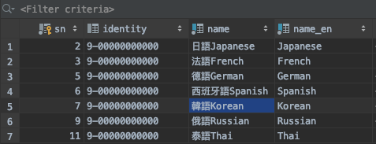
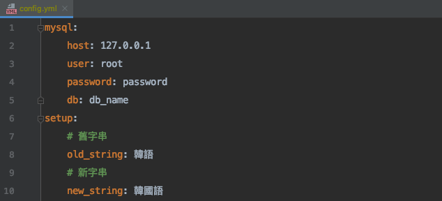
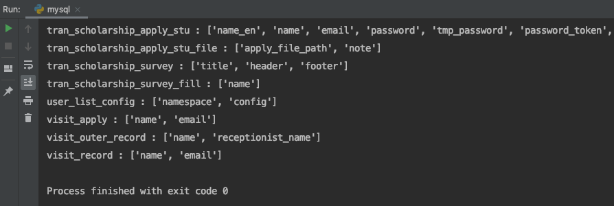
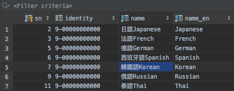

### 資料庫字串變更
把 config.yml.sample 拷貝一份為 config.yml

針對一個資料庫中裡面所有的資料表的 varchar, text 欄位，做字串置換

---

**注意事項**

1. 如果執行失敗，將失敗卡住的資料表加到排除名單，再手動處理該資料表

2. 如果有資料量太大的資料表，會引起 buffer 不足的問題，目前只能先排除該資料表 

---

**執行環境**

python 3.7

---

**使用方式**

1. 例如要將資料庫中所有 varchar, text 中的「韓語」置換成「韓國語」
   
   

2. 在 yaml 設定檔中設定舊字串和新字串
   
   

3. 視安裝環境而定，執行

   `python3 run.py` 或 `python run.py` 
   
   

4. 成功將文字「韓語」置換成「韓國語」 
   
   
